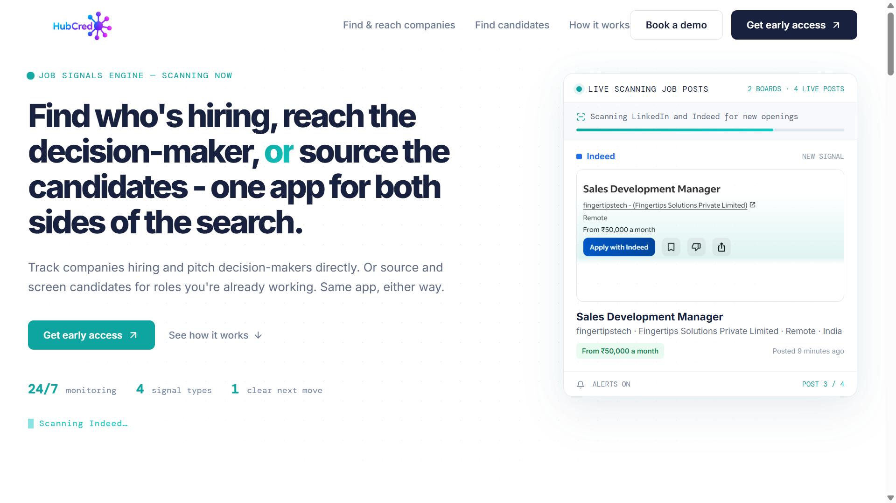

# HubCredo Recruit — Find Who's Hiring, Reach the Decision-Maker, or Source the Candidates

**Live Website:** [https://hr.hubcredo.com/](https://hr.hubcredo.com/)

## What is HubCredo Recruit?

Recruiting and B2B sales teams both face the same problem from opposite sides — one side is looking for companies that are hiring, the other is looking for candidates to fill roles. Most teams end up switching between job boards, LinkedIn, and spreadsheets just to keep track of who's hiring and who's available.

**HubCredo Recruit puts both sides of the search in one app.**

Whether you want to track companies that are actively hiring so you can pitch the decision-maker, or you're sourcing and screening candidates for roles you're already working, HubCredo Recruit gives you one dashboard to do it all — powered by a live job signals engine that never stops watching.

Think of it as **one app for both sides of the search** — hiring signals for outreach, and candidate sourcing for recruiting.

---

## How It Works (In Plain English)

### Step 1: The Job Signals Engine Scans 24/7
HubCredo Recruit continuously scans job boards like **LinkedIn and Indeed** for new job postings the moment they go live — no manual searching required.

### Step 2: New Hiring Signals Land in Your Feed
Every new job post is captured as a live signal — company name, role, location, salary, and how long ago it was posted — so you always know who's hiring right now.

### Step 3: Track Companies and Reach Decision-Makers
Use hiring activity as a trigger to identify and pitch the decision-maker at companies that are actively growing their teams.

### Step 4: Or Flip It — Source and Screen Candidates
For roles you're already working, use the same app to source and screen candidates, instead of hopping between separate tools.

### Step 5: One Clear Next Move
Every signal is boiled down to one clear next move, so you're never stuck wondering what to do with the information — you just act on it.

---

## Key Features

| Feature | What It Does For You |
|---|---|
| 📡 **Job Signals Engine** | Monitors LinkedIn and Indeed 24/7 and surfaces new job postings as live signals the moment they appear. |
| 🏢 **Find & Reach Companies** | Turns hiring activity into a pipeline of companies to pitch, so you can reach the decision-maker directly. |
| 👤 **Find Candidates** | Source and screen candidates for the roles you're already working, in the same app. |
| 🔔 **Live Alerts** | Get notified as new postings come in, with boards and posts tracked in real time. |
| 🧭 **One Clear Next Move** | Every signal type is designed to point to a single, obvious next action. |
| 🔁 **One App, Both Sides** | No need to run separate tools for hiring intelligence and candidate sourcing — it's all connected. |

---

## Why Teams Choose HubCredo Recruit

- ⏱️ **Saves Time** — Hiring signals are surfaced automatically instead of manually refreshing job boards.
- 🎯 **Two Use Cases, One App** — Works for outreach teams tracking hiring companies *and* recruiters sourcing candidates.
- 📶 **Always On** — 24/7 monitoring across multiple job boards means you never miss a new signal.
- 🧩 **No Technical Skill Needed** — The dashboard is built to give you a clear next move, not raw data to sort through.

---

## Who Is This For?

- **Sales & BD Teams** who want to reach out the moment a target company starts hiring.
- **Recruiters & Staffing Agencies** who need to source and screen candidates for open roles.
- **Founders & Small Teams** who want hiring intelligence without hiring a research team.
- **Anyone who wants one app** instead of separate tools for tracking hiring signals and sourcing candidates.

---

## See It In Action

👉 Visit the live product here: **[https://hr.hubcredo.com/](https://hr.hubcredo.com/)**

---
